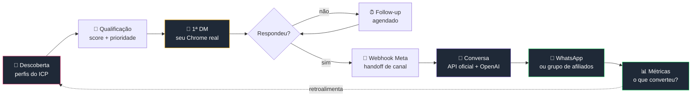

<div align="center">

# 🚀 Buscando 1 Milhão

### Construindo um sistema comercial autônomo, em público, até bater **R$ 1.000.000** em faturamento.

<br/>


<br/>


<br/>

**[O que é](#-o-que-é) · [Como funciona](#-como-funciona) · [Começando](#-começando) · [Estrutura](#-estrutura) · [Roadmap](#-roadmap)**

</div>

---

## 🎯 O que é

Um agente de IA que prospecta pelo Instagram sozinho: acha o lead, qualifica, escreve a primeira mensagem, entende a resposta, conduz a conversa, encaminha pro WhatsApp e **aprende com o que converteu** — ajustando público, texto, horário e cadência sem ninguém mandar.

Roda 100% local. Seu banco, sua sessão, sua chave.

O repositório é o diário de bordo: cada commit é um passo até o milhão, e você pode clonar, trocar os `{{PLACEHOLDERS}}` e rodar no seu próprio negócio.

```
Observar → Decidir → Agir → Medir → Aprender → Adaptar
```

<br/>

## ⚙️ Como funciona



### Por que dois canais

| Etapa | Canal | Motivo |
|:--|:--|:--|
| **Primeiro contato** | Seu Chrome, sua sessão | A API oficial da Meta **não abre** conversa com quem nunca te respondeu |
| **Depois da resposta** | API oficial + webhook | É o caminho suportado, auditável e estável |

Uma **trava de canal** garante que os dois nunca escrevam no mesmo fio. Depois do handoff, o navegador está proibido de responder.

<br/>

## 🚦 Começando

```bash
git clone https://github.com/{{SEU_USUARIO}}/buscandomilhao.git
cd buscandomilhao
pnpm install
```

**1. Seus dados**

```bash
cp config/business.example.json config/business.json
```

Troque todos os `{{PLACEHOLDERS}}`: nome, empresa, site, @ do Instagram, WhatsApp, oferta e ICP. Esse arquivo é a única fonte de identidade — nada de dado real espalhado pelo código.

**2. Sua chave da OpenAI**

```bash
cp .env.example .env
```

Passo a passo em **[docs/01-openai-setup.md](docs/01-openai-setup.md)** — incluindo teto de gasto, que é o que te salva de um loop caro.

**3. Sua sessão do Instagram**

```bash
/Applications/Google\ Chrome.app/Contents/MacOS/Google\ Chrome \
  --remote-debugging-port=9222 \
  --user-data-dir="$PWD/.chrome-profile"
```

Logue uma vez nessa janela. Perfil dedicado, separado do seu pessoal — o agente nunca vê suas abas. Detalhes e comandos de Linux/Windows em **[docs/02-browser-session.md](docs/02-browser-session.md)**.

**4. Subir**

```bash
pnpm dev     # painel + worker
```

<br/>

## 📁 Estrutura

```
buscandomilhao/
├── 📄 README.md
├── 🔐 .env.example              chaves e limites de autonomia
│
├── 📁 config/
│   └── business.example.json    identidade, oferta, ICP, claims
│
├── 📁 prompts/
│   └── master-prompt.md         ⭐ o prompt que constrói o sistema
│
├── 📁 docs/
│   ├── 01-openai-setup.md       chave, modelos, controle de custo
│   └── 02-browser-session.md    Chrome real via CDP + ritmo humano
│
└── 📁 src/                      (em construção)
    ├── app/                     painel Next.js — PT-BR
    ├── features/                leads · conversations · campaigns · experiments · affiliates
    ├── integrations/            instagram · browser · openai · whatsapp
    ├── db/                      SQLite + Drizzle
    └── worker/                  jobs duráveis
```

<br/>

## 🛡️ Regras que não se negocia

<details>
<summary><b>Como o agente não queima a conta</b></summary>

<br/>

| Controle | Padrão |
|:--|:--|
| DMs por dia | 30, com aquecimento gradual |
| Intervalo entre DMs | 90–240s aleatório |
| Janela de operação | 09:00–20:00, fuso configurável |
| Circuit breaker | Pausa tudo em erro anormal, restrição ou opt-out em alta |

Ritmo humano existe por **saúde da conta** — mesma disciplina de um SDR de verdade. Não tem fingerprint forjado, API privada nem tentativa de burlar bloqueio.

</details>

<details>
<summary><b>Como o agente não mente</b></summary>

<br/>

A IA só pode afirmar o que está em `verified_claims`. Qualquer coisa em `unverified_claims` fica bloqueada até virar prova.

Ela nunca inventa taxa, condição, garantia ou superlativo, nunca promete aprovação de conta, e nunca finge ser cliente pra arrancar resposta.

</details>

<details>
<summary><b>Como o agente respeita quem não quer</b></summary>

<br/>

Pedido de parar é atendido na hora. O perfil entra em `do_not_contact` — permanente, sem follow-up, sem reentrada por outra campanha, por nenhum canal.

</details>

<details>
<summary><b>Como o custo não explode</b></summary>

<br/>

Toda chamada à OpenAI grava tokens e custo. Ao bater `OPENAI_MONTHLY_BUDGET_USD`, o sistema pausa sozinho.

O painel mostra **custo por lead** e **custo por cliente ativo** — sem isso não dá pra saber se a automação dá lucro.

</details>

<br/>

## 🗺️ Roadmap

| | Fase | Status |
|:--|:--|:--|
| `01` | Prompt mestre e arquitetura | ✅ |
| `02` | Banco, migrações e estados | ⬜ |
| `03` | CRM em PT-BR | ⬜ |
| `04` | Worker e jobs duráveis | ⬜ |
| `05` | Descoberta + 1ª DM pelo navegador | ⬜ |
| `06` | Webhook Meta + handoff de canal | ⬜ |
| `07` | Motor de conversação (OpenAI) | ⬜ |
| `08` | Experimentos e otimização | ⬜ |
| `09` | Dry-run e piloto limitado | ⬜ |
| `10` | Autonomia ligada 🚀 | ⬜ |

<br/>

## 📈 Placar

```
R$ 0 ▏░░░░░░░░░░░░░░░░░░░░░░░░░░░░░░░░░░░░░░░░ R$ 1.000.000
```

| Métrica | Valor |
|:--|--:|
| Leads descobertos | `0` |
| DMs enviadas | `0` |
| Taxa de resposta | `—` |
| Encaminhados ao WhatsApp | `0` |
| Clientes ativos | `0` |
| **Faturamento** | **`R$ 0`** |

<br/>

---

<div align="center">

**Este repositório é público de propósito.**

Clone, troque os `{{PLACEHOLDERS}}`, e construa o seu.

<br/>

⭐ Se isso te ajudou, deixa uma estrela e acompanha a jornada.

</div>
